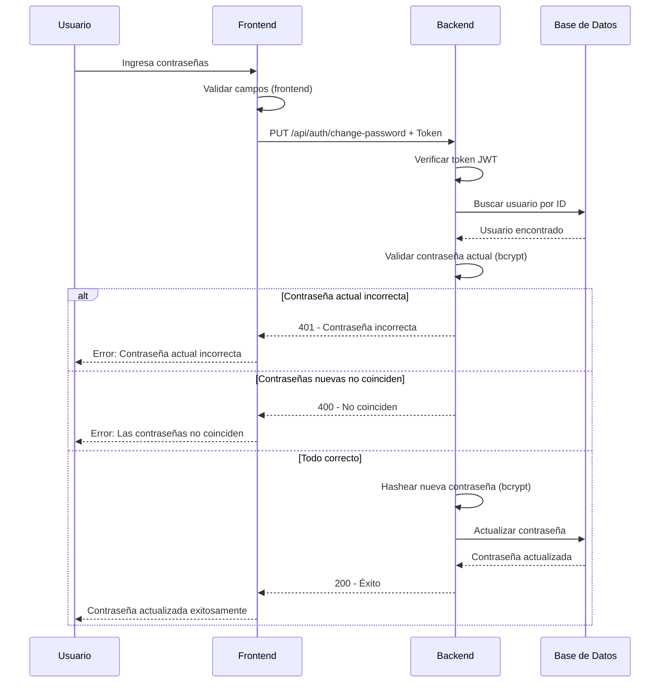

# API de Cambio de Contraseña

## Endpoint: Change Password

### **PUT** `/api/auth/change-password`

Permite a un usuario autenticado cambiar su contraseña actual por una nueva.

---

## 🔒 Autenticación Requerida

Este endpoint requiere autenticación mediante Bearer Token en el header.

---

## 📋 Request

### Headers
```json
{
  "Content-Type": "application/json",
  "Authorization": "Bearer <token>"
}
```

### Body (JSON)
```json
{
  "Contraseña_Actual": "password123",
  "Contraseña_Nueva": "newSecurePassword456!",
  "Confirmar_Contraseña": "newSecurePassword456!"
}
```

#### Parámetros del body:

| Campo | Tipo | Requerido | Descripción |
|-------|------|-----------|-------------|
| `Contraseña_Actual` | String | ✅ Sí | Contraseña actual del usuario |
| `Contraseña_Nueva` | String | ✅ Sí | Nueva contraseña (mínimo 6 caracteres) |
| `Confirmar_Contraseña` | String | ✅ Sí | Confirmación de la nueva contraseña (debe coincidir) |

---

## 📤 Response

### ✅ Éxito (200 OK)
```json
{
  "message": "Contraseña actualizada exitosamente"
}
```

### ❌ Errores

#### 400 - Campos faltantes
```json
{
  "error": "Todos los campos son obligatorios."
}
```

#### 400 - Contraseña muy corta
```json
{
  "error": "La nueva contraseña debe tener al menos 6 caracteres."
}
```

#### 400 - Contraseñas no coinciden
```json
{
  "error": "La nueva contraseña y la confirmación no coinciden."
}
```

#### 400 - Contraseña igual a la actual
```json
{
  "error": "La nueva contraseña debe ser diferente de la actual."
}
```

#### 401 - Contraseña actual incorrecta
```json
{
  "error": "La contraseña actual es incorrecta."
}
```

#### 401 - No autenticado
```json
{
  "error": "Token no proporcionado"
}
```

#### 404 - Usuario no encontrado
```json
{
  "error": "Usuario no encontrado."
}
```

#### 500 - Error del servidor
```json
{
  "error": "Error al cambiar contraseña: [mensaje de error]"
}
```

---

## 💻 Ejemplos de uso

### Ejemplo con cURL
```bash
curl -X PUT http://localhost:3000/api/auth/change-password \
  -H "Content-Type: application/json" \
  -H "Authorization: Bearer YOUR_TOKEN_HERE" \
  -d '{
    "Contraseña_Actual": "password123",
    "Contraseña_Nueva": "newSecurePassword456!",
    "Confirmar_Contraseña": "newSecurePassword456!"
  }'
```

### Ejemplo con JavaScript (fetch)
```javascript
const changePassword = async (currentPassword, newPassword, confirmPassword) => {
  try {
    const token = sessionStorage.getItem('authToken');
    
    const response = await fetch('http://localhost:3000/api/auth/change-password', {
      method: 'PUT',
      headers: {
        'Content-Type': 'application/json',
        'Authorization': `Bearer ${token}`
      },
      body: JSON.stringify({
        Contraseña_Actual: currentPassword,
        Contraseña_Nueva: newPassword,
        Confirmar_Contraseña: confirmPassword
      })
    });

    const data = await response.json();
    
    if (!response.ok) {
      throw new Error(data.error || 'Error al cambiar contraseña');
    }

    console.log(data.message);
    return data;
  } catch (error) {
    console.error('Error:', error);
    throw error;
  }
};

// Uso
changePassword('oldPassword123', 'newPassword456!', 'newPassword456!')
  .then(data => console.log('Contraseña cambiada exitosamente'))
  .catch(error => console.error('Error:', error.message));
```

### Ejemplo con authenticatedFetch (Frontend TCA)
```javascript
import { authenticatedFetch } from '@/lib/auth';

const changePassword = async (currentPassword, newPassword, confirmPassword) => {
  try {
    const apiHost = process.env.NEXT_PUBLIC_API_HOST || 'http://localhost:3000';
    
    const response = await authenticatedFetch(`${apiHost}/api/auth/change-password`, {
      method: 'PUT',
      body: JSON.stringify({
        Contraseña_Actual: currentPassword,
        Contraseña_Nueva: newPassword,
        Confirmar_Contraseña: confirmPassword
      })
    });

    if (!response.ok) {
      const error = await response.json();
      throw new Error(error.error || 'Error al cambiar contraseña');
    }

    const data = await response.json();
    return data;
  } catch (error) {
    console.error('Error:', error);
    throw error;
  }
};
```

### Ejemplo con Postman

1. **Método**: PUT
2. **URL**: `http://localhost:3000/api/auth/change-password`
3. **Headers**:
   - `Content-Type: application/json`
   - `Authorization: Bearer YOUR_TOKEN_HERE`
4. **Body** (raw JSON):
```json
{
  "Contraseña_Actual": "password123",
  "Contraseña_Nueva": "newSecurePassword456!",
  "Confirmar_Contraseña": "newSecurePassword456!"
}
```

---

## 🔄 Flujo completo



---

## 🔐 Validaciones implementadas

1. ✅ **Todos los campos son obligatorios**: `Contraseña_Actual`, `Contraseña_Nueva`, `Confirmar_Contraseña`
2. ✅ **Longitud mínima**: La nueva contraseña debe tener al menos 6 caracteres
3. ✅ **Contraseñas coinciden**: `Contraseña_Nueva` === `Confirmar_Contraseña`
4. ✅ **Contraseña diferente**: La nueva contraseña no puede ser igual a la actual
5. ✅ **Verificación de contraseña actual**: Compara con bcrypt la contraseña actual
6. ✅ **Autenticación requerida**: Requiere token JWT válido
7. ✅ **Hash automático**: La nueva contraseña se hashea automáticamente antes de guardar

---

## 🛡️ Seguridad

1. **Requiere autenticación**: Solo usuarios logueados pueden cambiar su contraseña
2. **Verifica contraseña actual**: Previene cambios no autorizados
3. **Hash bcrypt**: Las contraseñas se almacenan hasheadas (10 rondas de salt)
4. **Token JWT**: Identifica al usuario de forma segura
5. **Validación de coincidencia**: Confirma que el usuario escribió correctamente la nueva contraseña

---

## 📝 Notas adicionales

1. **Hook automático**: El modelo User tiene un hook `beforeUpdate` que hashea automáticamente la contraseña antes de guardarla
2. **No expone información sensible**: Los errores no revelan si un usuario existe
3. **Token en sessionStorage**: El frontend almacena el token de forma segura
4. **Logout opcional**: Se recomienda hacer logout después de cambiar la contraseña (opcional)

---

## 🧪 Testing

### Escenario 1: Cambio exitoso
```json
// Request
{
  "Contraseña_Actual": "password123",
  "Contraseña_Nueva": "newPassword456!",
  "Confirmar_Contraseña": "newPassword456!"
}

// Response (200)
{
  "message": "Contraseña actualizada exitosamente"
}
```

### Escenario 2: Contraseña actual incorrecta
```json
// Request
{
  "Contraseña_Actual": "wrongPassword",
  "Contraseña_Nueva": "newPassword456!",
  "Confirmar_Contraseña": "newPassword456!"
}

// Response (401)
{
  "error": "La contraseña actual es incorrecta."
}
```

### Escenario 3: Contraseñas no coinciden
```json
// Request
{
  "Contraseña_Actual": "password123",
  "Contraseña_Nueva": "newPassword456!",
  "Confirmar_Contraseña": "differentPassword789!"
}

// Response (400)
{
  "error": "La nueva contraseña y la confirmación no coinciden."
}
```

### Escenario 4: Contraseña muy corta
```json
// Request
{
  "Contraseña_Actual": "password123",
  "Contraseña_Nueva": "abc",
  "Confirmar_Contraseña": "abc"
}

// Response (400)
{
  "error": "La nueva contraseña debe tener al menos 6 caracteres."
}
```

---

Última actualización: 19 de noviembre de 2025
