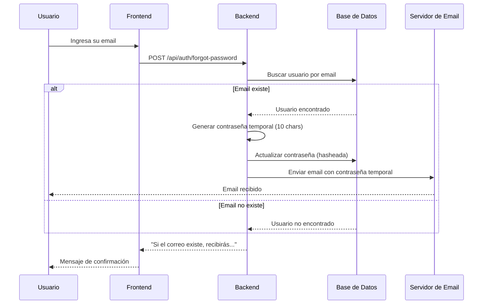

# API de Recuperación de Contraseña

## Endpoint: Forgot Password

### **POST** `/api/auth/forgot-password`

Permite a un usuario recuperar su contraseña enviando una contraseña temporal por correo electrónico.

---

## 📋 Request

### Headers
```json
{
  "Content-Type": "application/json"
}
```

### Body (JSON)
```json
{
  "email": "usuario@ejemplo.com"
}
```

#### Parámetros del body:

| Campo | Tipo | Requerido | Descripción |
|-------|------|-----------|-------------|
| `email` | String | ✅ Sí | Correo electrónico del usuario registrado |

---

## 📤 Response

### ✅ Éxito (200 OK)
```json
{
  "message": "Si el correo existe, recibirás una contraseña temporal en breve."
}
```

**Nota de seguridad:** Por razones de seguridad, siempre se devuelve el mismo mensaje, independientemente de si el email existe o no en la base de datos. Esto previene que atacantes puedan enumerar usuarios válidos.

### ❌ Error del servidor (500)
```json
{
  "message": "Error del servidor"
}
```

---

## 📧 Email enviado al usuario

Si el correo existe en la base de datos, el usuario recibirá un email con:

**Asunto:** Recuperación de contraseña

**Contenido:**
```
¡Hola [Nombre del usuario]!

Hemos generado una nueva contraseña temporal para tu cuenta:

Contraseña temporal: [Contraseña generada]

Esta contraseña tiene 10 caracteres y contiene mayúsculas, minúsculas, números y símbolos.

Por seguridad, te recomendamos cambiarla lo antes posible después de iniciar sesión.

Si no solicitaste este cambio, ignora este correo.

Saludos,
El equipo de TCA
```

---

## 🔐 Características de seguridad

1. **Contraseña temporal segura**: 
   - Longitud: 10 caracteres
   - Incluye: mayúsculas, minúsculas, números y símbolos
   - Generada aleatoriamente

2. **Hash automático**: 
   - La contraseña se hashea automáticamente antes de guardarse
   - Utiliza bcrypt con 10 rondas de salt

3. **No revela información**: 
   - Siempre devuelve el mismo mensaje
   - Previene enumeración de usuarios

---

## 💻 Ejemplos de uso

### Ejemplo con cURL
```bash
curl -X POST http://localhost:3000/api/auth/forgot-password \
  -H "Content-Type: application/json" \
  -d '{"email": "juan.perez@example.com"}'
```

### Ejemplo con JavaScript (fetch)
```javascript
const forgotPassword = async (email) => {
  try {
    const response = await fetch('http://localhost:3000/api/auth/forgot-password', {
      method: 'POST',
      headers: {
        'Content-Type': 'application/json',
      },
      body: JSON.stringify({ email })
    });

    const data = await response.json();
    console.log(data.message);
  } catch (error) {
    console.error('Error:', error);
  }
};

// Uso
forgotPassword('usuario@ejemplo.com');
```

### Ejemplo con Axios
```javascript
const axios = require('axios');

axios.post('http://localhost:3000/api/auth/forgot-password', {
  email: 'usuario@ejemplo.com'
})
.then(response => {
  console.log(response.data.message);
})
.catch(error => {
  console.error('Error:', error);
});
```

### Ejemplo con Postman

1. **Método**: POST
2. **URL**: `http://localhost:3000/api/auth/forgot-password`
3. **Headers**:
   - `Content-Type: application/json`
4. **Body** (raw JSON):
```json
{
  "email": "juan.perez@example.com"
}
```

---

## 🧪 Testing en desarrollo

En modo desarrollo (cuando `NODE_ENV !== 'production'`):

1. Se usa **Ethereal Email** como servicio de correo de prueba
2. Los emails no se envían realmente
3. La consola muestra una URL para visualizar el email enviado:
   ```
   Email de prueba enviado:
   URL para verlo: https://ethereal.email/message/[message-id]
   ```

---

## ⚙️ Configuración en producción

Para usar en producción, configura las variables de entorno en `.env`:

```env
NODE_ENV=production
EMAIL_USER=tu-correo@gmail.com
EMAIL_PASS=tu-app-password
```

### Para Gmail:
1. Ve a tu cuenta de Google
2. Habilita la verificación en dos pasos
3. Genera una "Contraseña de aplicación"
4. Usa esa contraseña en `EMAIL_PASS`

---

## 🔄 Flujo completo



---

## 📝 Notas adicionales

1. **Usuarios de prueba** (según AUTH_README.md):
   - Email: `juan.perez@example.com`
   - Email: `maria.lopez@example.com`

2. **Después de recibir la contraseña temporal**:
   - El usuario debe iniciar sesión con la nueva contraseña
   - Se recomienda cambiarla inmediatamente

3. **Límite de intentos** (pendiente de implementar):
   - Se recomienda agregar rate limiting
   - Prevenir abuso del endpoint (max 3 intentos por hora)

---

## 🐛 Troubleshooting

### Error: "Cannot find module"
- Verifica que todas las dependencias estén instaladas:
  ```bash
  npm install nodemailer bcryptjs
  ```

### Error: "getTransporter is not a function"
- Asegúrate de que `mailer.js` esté exportando correctamente
- Verifica que uses ES6 imports: `import { getTransporter } from ...`

### El email no llega
- **Desarrollo**: Revisa la consola para obtener la URL de Ethereal
- **Producción**: Verifica las credenciales de `EMAIL_USER` y `EMAIL_PASS`

### Error: "User.findOne is not a function"
- Verifica que el modelo User esté correctamente importado
- Debe ser: `import User from '../models/userModel.js'`

---

## 🔒 Recomendaciones de seguridad

1. ✅ Implementar rate limiting (max 3 intentos por IP por hora)
2. ✅ Agregar CAPTCHA después de 2 intentos fallidos
3. ✅ Registrar todos los intentos en logs de auditoría
4. ✅ Enviar notificación al email existente si se intenta recuperar la contraseña
5. ✅ Expirar contraseñas temporales después de 24 horas
6. ✅ Forzar cambio de contraseña en el primer login con contraseña temporal

---

Última actualización: 19 de noviembre de 2025
